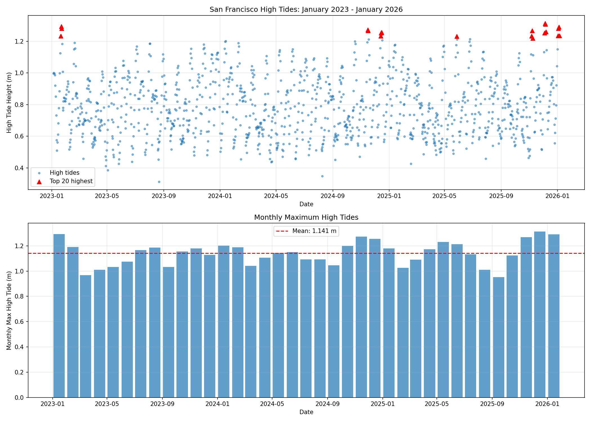
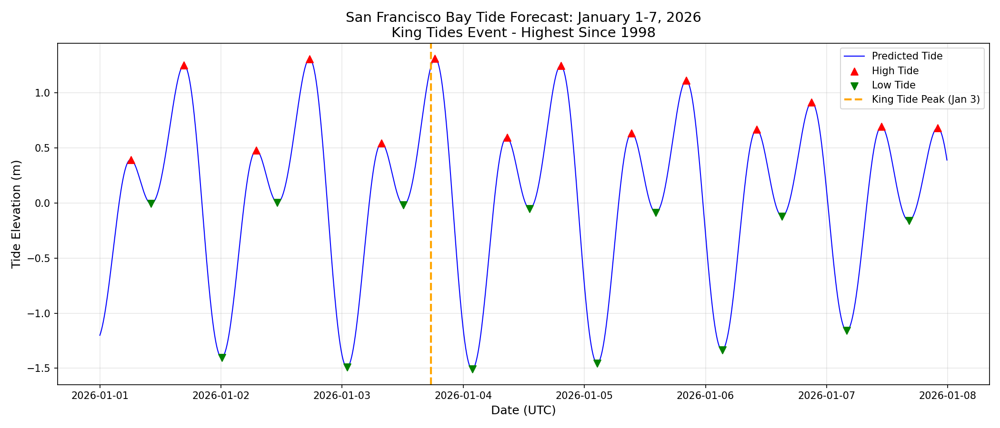

# Tide

Astronomical tide prediction at any (latitude, longitude, datetime).

```python
from tides import predict
from datetime import datetime

tide_meters = predict(37.8067, -122.465, datetime(2026, 1, 3, 17, 34))
# 1.23 m
```

## Installation

```bash
pip install "pyTMD[all]" timescale pandas matplotlib scipy
```

## Quick Start

### Python API

```python
import tides
from datetime import datetime

# Single prediction
tide = tides.predict(
    lat=37.8067,          # San Francisco
    lon=-122.465,
    time=datetime(2026, 1, 3, 17, 34)
)
print(f"{tide:.2f} m")  # 1.23 m

# Time series (hourly for one week)
df = tides.predict_timeseries(
    lat=37.8067,
    lon=-122.465,
    start=datetime(2026, 1, 1),
    end=datetime(2026, 1, 7),
    interval_minutes=60
)

# Find high and low tides
events = tides.find_high_low_tides(df)
highs = events[events['type'] == 'HIGH']

# Batch prediction (multiple locations, one time)
import numpy as np
lats = np.array([37.8, 37.9, 38.0])
lons = np.array([-122.4, -122.5, -122.6])
tide_array = tides.predict_batch(lats, lons, datetime(2026, 1, 3, 17, 34))
```

### Command Line

```bash
python tides.py 37.8067 -122.465 "2026-01-03 17:34"
# Location: (37.8067, -122.465)
# Time: 2026-01-03 17:34:00 UTC
# Tide height: 1.233 m (4.04 ft)
```

### Higher Resolution Model

The default GOT4.10 model has 0.5° (~55 km) resolution. For coastal applications, download EOT20 at 0.125° (~14 km):

```python
import tides
tides.download_eot20()       # ~2 GB download
tides.set_model('EOT20')     # Use for all predictions
```

## The Physics of Tides

### Gravitational Forces

Tides arise from the differential gravitational pull of the Moon and Sun across Earth's diameter. The Moon contributes ~68% of tidal force; the Sun ~32%.

```
                    ☽ Moon
                     ↓
    ┌─────────────────────────────────────┐
    │         🌊 High Tide                │
    │    ←─────── 🌍 ───────→             │
    │         🌊 High Tide                │
    └─────────────────────────────────────┘
```

When aligned (new/full moon), their forces combine to create **spring tides**. When perpendicular (quarter moons), they partially cancel, creating **neap tides**.

### King Tides

The highest astronomical tides occur when three orbital factors align:

| Factor | Description | Effect |
|--------|-------------|--------|
| **Syzygy** | Sun, Earth, Moon aligned (new/full moon) | +20-30% tidal range |
| **Lunar perigee** | Moon at closest approach (~356,000 km) | +5-8% tidal force |
| **Perihelion** | Earth closest to Sun (early January) | +3-4% solar tide |

**January 3-4, 2026** featured all three—producing the highest tides in San Francisco Bay since 1998.

### Tidal Constituents

Tides are decomposed into harmonic constituents, each representing an astronomical cycle:

| Constituent | Period | Origin |
|-------------|--------|--------|
| **M2** | 12.42 hrs | Principal lunar semidiurnal |
| **S2** | 12.00 hrs | Principal solar semidiurnal |
| **K1** | 23.93 hrs | Lunar/solar diurnal |
| **O1** | 25.82 hrs | Principal lunar diurnal |
| **N2** | 12.66 hrs | Lunar elliptic semidiurnal |

The predicted tide is the sum: **η(t) = Σ Aᵢ cos(ωᵢt + φᵢ)**

## How It Works

This library uses [pyTMD](https://pytmd.readthedocs.io/) for tide prediction:

1. **Load tidal constituent grids** from global ocean models (amplitude + phase)
2. **Interpolate** to your specific location
3. **Compute astronomical arguments** for your datetime
4. **Sum the harmonic contributions** to predict total tide height

### Available Models

| Model | Resolution | Access |
|-------|------------|--------|
| **GOT4.10** | 0.5° (~55 km) | Auto-downloads (NASA) |
| **EOT20** | 0.125° (~14 km) | `tides.download_eot20()` |
| **TPXO10** | 1/30° (~3 km) | Registration required |
| **FES2022** | 1/30° (~3 km) | Registration required |

## Example: January 2026 King Tides

```bash
python examples/king_tides_jan2026.py
```

This validates predictions against the January 2026 California floods:

```
ANNUAL KING TIDES (Top 5 highest tides per year)

2025:
  1. 2025-12-04 18:00:00: 1.314 m (4.31 ft)
  2. 2025-12-05 19:00:00: 1.308 m (4.29 ft)

2026:
  1. 2026-01-03 18:00:00: 1.290 m (4.23 ft)  ← King tide event
  2. 2026-01-02 18:00:00: 1.281 m (4.20 ft)

January 2026 king tide: Rank #4 out of 1242 high tides in 3-year period
```

Output plots are saved to `docs/`:

| 3-Year Analysis | January 2026 Forecast |
|-----------------|----------------------|
|  |  |

## Flood Modeling Integration

Astronomical tides are one component of total water level:

```
Total Water Level = Astronomical Tide + Storm Surge + Wave Setup + Sea Level Rise
```

For the January 2026 California floods:
- **Astronomical tide**: ~1.3 m (predicted by this library)
- **Storm surge**: ~0.3-0.5 m (from atmospheric models)
- **Sea level rise**: ~0.2 m above 20th century baseline

## Resources

### Tide Models
- [pyTMD Documentation](https://pytmd.readthedocs.io/)
- [EOT20 (SEANOE)](https://doi.org/10.17882/79489)
- [GOT Models (NASA)](https://earth.gsfc.nasa.gov/geo/data/ocean-tide-models)
- [TPXO (Oregon State)](https://www.tpxo.net/)
- [FES (AVISO)](https://www.aviso.altimetry.fr/)

### Flood Data
- [USGS Water Monitoring](https://dashboard.waterdata.usgs.gov/app/nwd/en/?region=lower48)
- [FEMA Flood Zones](https://hazards-fema.maps.arcgis.com/apps/webappviewer/index.html?id=8b0adb51996444d4879338b5529aa9cd)
- [Global Flood Database](https://www.nature.com/articles/s41586-021-03695-w)

## Citations

**pyTMD:**
> T. C. Sutterley, S. L. Howard, L. Padman, and M. Siegfried, "pyTMD: Python-based tidal prediction software," *Journal of Open Source Software*, 10(116), 8566 (2025). [doi:10.21105/joss.08566](https://doi.org/10.21105/joss.08566)

**EOT20:**
> Hart-Davis M., Piccioni G., Dettmering D., Schwatke C., Passaro M., Seitz F. (2021). EOT20: a global ocean tide model from multi-mission satellite altimetry. *Earth System Science Data*, 13(8), 3869-3884. [doi:10.5194/essd-13-3869-2021](https://doi.org/10.5194/essd-13-3869-2021)

> Hart-Davis M. et al. (2021). EOT20 - A global Empirical Ocean Tide model from multi-mission satellite altimetry. SEANOE. [doi:10.17882/79489](https://doi.org/10.17882/79489)

## License

MIT
